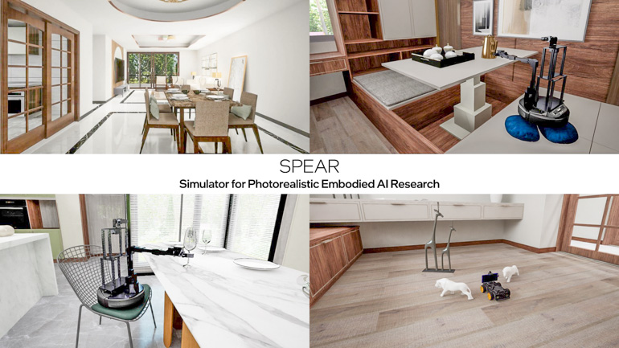
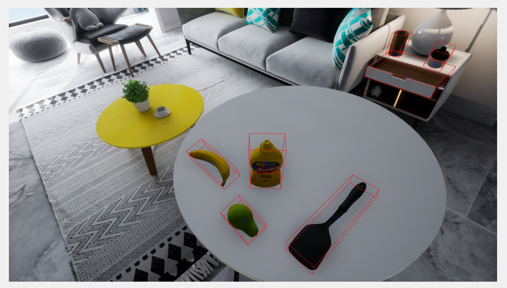
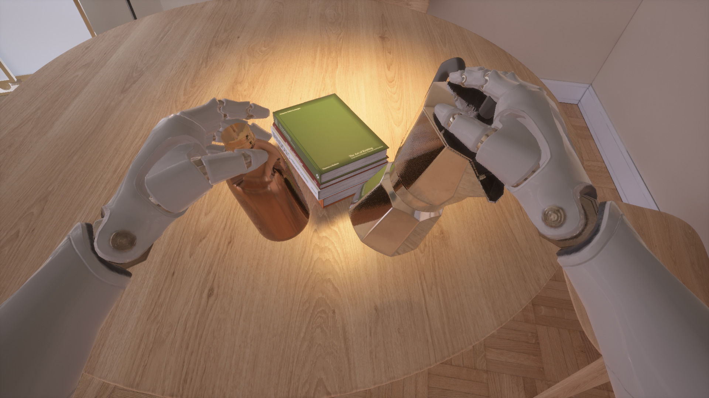
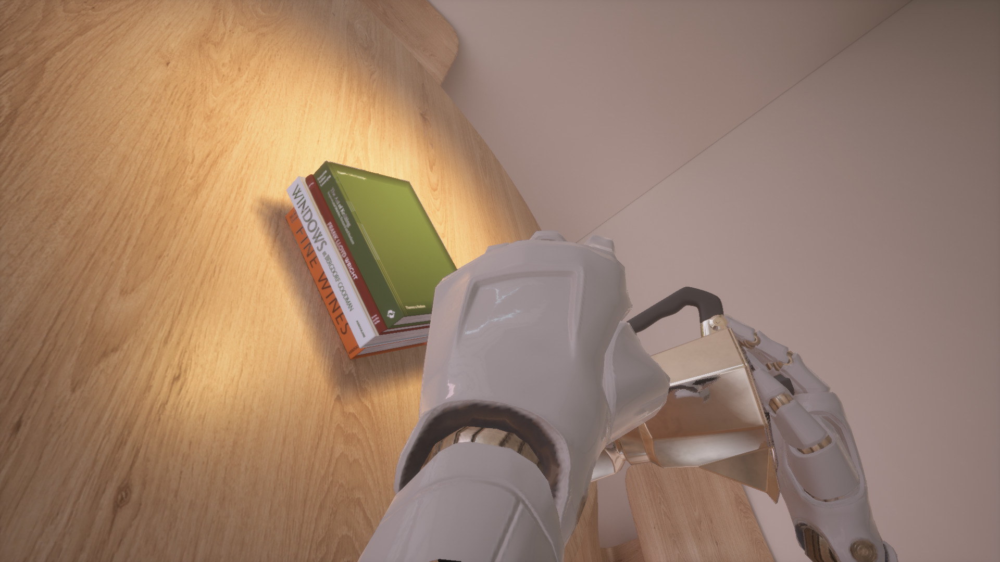
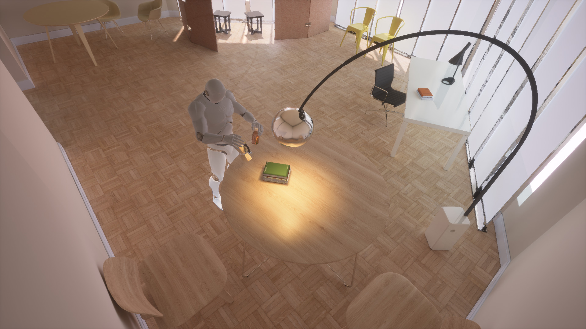

# Фотореалистичные симуляторы + датасеты для задачи IBVS 

Добрый день, утро, ночь! В качестве тестового задания был выдан файл с 4 пунктами, однако вроде как выполнить нужно было только первый пункт. Я не был уверен, что делать, поэтому постарался выполнить 2/4 пунктов (самые важные не получилось выполнить в следствие ограниченности производительности ПК). В этом репозитории вы найдёте:

1. Описания двух фотореалистичных симуляторов для построения сцен для обучения нейронной сети для задачи IBVS. Также есть предложение о плагинах, изменениях и технологиях, которые можно внести в эти open source проекты.

2. Датасеты с фотореалистичными 3D моделями бытовых предметов, пригодные для манипуляций роботом.

3. ~~Третий пункт, к сожалению, не был выполнен. (см. 4 пункт)~~

4. ~~Четвёртый пункт не был выполнен по той же причине, что и третий.~~

## 1. Фотореалистичные симуляторы:

В качестве фотореалистичных симуляторов были выбраны 2 open source проекта:

- [SPEAR: A Simulator for Photorealistic Embodied AI Research](https://github.com/isl-org/spear#building-from-source)

Данный симулятор разработала Intel Labs в сотрудничестве с Центром компьютерного зрения в Испании, Куджиале в Китае и Мюнхенским техническим университетом. Этот проект - фотореалистичная платформа моделирования с открытым исходным кодом, которая ускоряет обучение и валидацию различных систем искусственного интеллекта. Основная область данного проекта - симуляции в закрытых помещениях. Решение можно загрузить по [лицензии MIT](https://github.com/isl-org/spear/blob/main/LICENSE.txt) с открытым исходным кодом.

SPEAR можно запустить на macOS, Windows или Linux. Для работы необходим Unreal Engine 5.2, ссылка на который уже лежит в репозитории. Также есть подробная инструкция по установке, причём подробная для всех платформ.

- [UnrealROX](https://github.com/3dperceptionlab/unrealrox#unrealrox)

UnrealROX - это среда, построенная на движке Unreal Engine 4. Она описана в [этой статье](https://arxiv.org/pdf/1810.06936.pdf). Основным преимуществом данного симулятора является [подробная документация](https://unrealrox.readthedocs.io/en/latest/) и возможность "цеплять" камеру куда угодно, тем самым тренируя нейросети для различных конфигураций IBVS.

Небольшая сводная таблица о двух симуляторах:

|                               | SPEAR                                       | UnrealROX                                |
| ----------------------------- | ------------------------------------------- | ---------------------------------------- |
| Лицензия                      | MIT License                                 | MIT License                              |
| Движок                        | Unreal Engine 5.2                           | Unreal Engine 4                          |
| Поддержка VR                  | Нативной нет                                | Есть                                     |
| Предпочтительная конфигурация | Eye-to-hand / end-point closed-loop control | Обе конфигурации доступны "из коробки"   |
|||

Фотореализм важен для задачи IBVS. Но фотореализм требует большой производительности, и кол-во FPS обычно оставляет желать лучшего. Недавно вышла [статья](https://dl.acm.org/doi/pdf/10.1145/3592433), авторы которой смогли разработать эффективный алгоритм, позволяющий довольно быстро обучать и гораздо быстрее использовать 3D Gaussian Splatting. Подобная технология даёт поражающие результаты в области фотореализма. Если необходимо отсканировать некое помещение и фотореалистично отобразить его, то это как раз нужная технология (отражения, полупрозрачные объекты получаются несравнимо лучше чем, например, у NeRF). Она прекрасно работает как раз внутри помещений (небо довольно сложно "нарисовать" с помощью неё, а вот потолок нет).

Оба описанных здесь симулятора построены на базе движка Unreal Engine, что позволяет легко создавать фотореалистичные сцены. Однако SPEAR от Intel построен на 5ой версии UE, к которой уже существует [плагин](https://www.unrealengine.com/marketplace/en-US/product/3d-gaussians-plugin) в маркетплейсе. Очень советую обратить внимание на эту технологию.